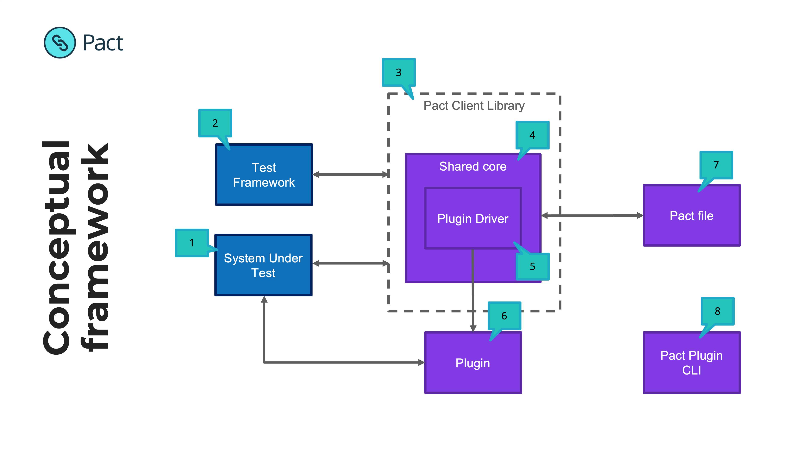

# Plugin drivers

Plugin drivers provide the functionality to find, load and interface to the plugins for the Pact test framework. Each language
with a Pact implementation requires a plugin driver to work with plugins.

Main plugin driver responsibilities:
* The ability to find plugins.
* Load plugins and extract the plugin manifests that describe what the plugin provides.
* Provide a catalogue of features provided by the plugins.
* Provide a messaging bus to facilitate communication between the language implementation and the plugins.
* Manage the plugin lifecycles.

## Conceptual Overview




1. Your code 😉
2. The test framework executing tests e.g. Jest, JUnit
3. The Pact Client library used in the test e.g. Pact JS, Pact JVM
4. The Shared Core (Rust) or the Java Plugin Driver (for JVM projects) manages the lifecycle of a Pact test and provides key capabilities to client libraries. It oversees the use of plugins via the Plugin Driver

5. Plugin driver is responsible for discovering, starting and orchestrating plugins.
6. Plugin may communicate to/from the SUT e.g. in the case of a new transport it will serve as the mock server, and will also issue verification requests at the Provider API
7. The pact file contains additional information
   * Required plugins
   * Transports
   * Interaction type
   * Markdown to display interactions

## Locating plugins

Plugins must be stored on the system in a Pact plugins directory, defined either by the `PACT_PLUGIN_DIR` environment 
variable or in the default `$HOME/.pact/plugins`. Each plugin must be in a separate sub-directory (plugin name/version) and contain a plugin
manifest file `pact-plugin.json`.

## Plugin manifest file

The plugin manifest file describes what the plugin provides and how to load it. It is a JSON file with the following attributes:

| Attribute | Description |
| --------- | ----------- |
| manifestVersion | Version of the manifest file format. Current is 1 |
| pluginInterfaceVersion | Version of the plugin interface the plugin supports. Current is 1 |
| name | Name of the plugin |
| version | Version of the plugin, following the semver format |
| executableType | Executable type of the plugin. Supported types are: exec (executable binary) |
| minimumRequiredVersion | Minimum required version of the runtime/interpreter to run the plugin |
| entryPoint | The main executable for the plugin |
| entryPoints | Optional map of additional entry points. This allows additional entry points for other operating systems (i.e. requiring a .bat file for Windows) |
| dependencies | List of system dependencies or plugins required to be able to execute this plugin |
| args | Optional, comma seperated list of arguments to pass to the plugin entrypoint |

Example of a manifest for a plugin written in Ruby that provides matching CSV files:

```json
{
  "manifestVersion": 1,
  "pluginInterfaceVersion": 1,
  "name": "pact-csv",
  "version": "0.0.0",
  "executableType": "exec",
  "minimumRequiredVersion": "2.7.2",
  "entryPoint": "bin/bundle",
  "args": ["exec", "ruby", "main.rb"]
}
```

See [CSV Plugin](../plugins/csv/pact-plugin.json) and [Protobuf plugin](../plugins/protobuf/pact-plugin.json) for examples of plugin manifests.

## Getting the port of the plugin GRPC server

When the plugin is started (except for the DLL executable type), the plugin will print a JSON message to its
standard output that contains the port that the plugin GRPC server is running on. The driver needs to poll the
plugin standard output for this message.

The message will have the following attributes:

| Attribute | Description |
| --------- | ----------- |
| port | The port number the GRPC server for the plugin is listening on |
| serverKey | A randomly generated key required to use as a bearer token when communicating with the plugin |

Example:

```json
{"port": 12345, "serverKey": "b37d2d9a9ceb"}
```

## Init request to the plugin

Once the port has been extracted from the plugin standard output, the driver must send a `InitPluginRequest`
message via GRPC to the plugin. The plugin will respond with a `InitPluginResponse` which will contain all the
catalogue entries for the features that the plugin provides. The driver needs to update its catalogue with these
entries and then publish the updated catalogue to all loaded plugins (including the new one).

## Feature Catalogue

Each entry in the catalogue is keyed based on the following structure: `$providerType/$name?/$type/$key`, where the
different parts are defined by:

| Attribute | Description |
| --------- | ----------- |
| providerType | Denotes an entry from the core Pact framework (`core`) or from a plugin (`plugin`) |
| name | The name of the plugin (omitted for core entries) |
| type | The type of the entry. Valid values are: content-matcher, content-generator, matcher, interaction |
| key | Key for the type. It must be unique withing the entries for the plugin. |

For example, a plugin entry for matching CSV bodies would be `plugin/csv/content-matcher/csv`.

Each entry can also contain associated data in key/value form. 

### Catalogue entry types

The following describes the types of entries:

#### Content Matcher (content-matcher)

Content matchers are responsible for matching request and response bodies and message payloads. Each entry must have
a `content-types` associated value with the list of content types the matcher supports (separated by semi-colons `;`).

For example, the entry for a CSV content matcher would be:
```
{
    type: EntryType::ContentMatcher,
    key: "csv",
    values: {
        "content-types": "text/csv;application/csv"
    }
}
```

#### Content Generator (content-generator) 

Content matchers are responsible for constructing request and response bodies and message payloads. Each entry must have
a `content-types` associated value with the list of content types the generator supports (separated by semi-colons `;`).

For example, the entry for a CSV content generator would be:
```
{
    type: EntryType::ContentGenerator,
    key: "csv",
    values: {
        "content-types": "text/csv;application/csv"
    }
}
```

#### Matcher (matcher)

Implementation of a matching rule. Mainly used to match the fields and attributes in the bodies and payloads.

#### Interaction (interaction) 

Provides a type of interaction. The standard interaction types are synchronous request/response (HTTP), asynchronous
messages (one off or fire and forget) and synchronous messages (request/response, like gRPC).

### Core catalogue entries

The driver must provide the following entries from the Pact framework:

| Key | Description |
| --- | ----------- |
| `core/interaction/http` | Support Http/1.1 interactions (request/response) | 
| `core/interaction/https` | Support Http/1.1 + TLS interactions (request/response) |
| `core/interaction/message` | Support message interactions |
| `core/matcher/v2-regex` | V2 spec regex matcher |
| `core/matcher/v2-type` | V2 spec type matcher |
| `core/matcher/v3-number-type` | V3 spec number matcher |
| `core/matcher/v3-integer-type` | V3 spec integer matcher |
| `core/matcher/v3-decimal-type` | V3 spec decimal matcher |
| `core/matcher/v3-date` | V3 spec date matcher |
| `core/matcher/v3-time` | V3 spec time matcher |
| `core/matcher/v3-datetime` | V3 spec DateTime matcher |
| `core/matcher/v2-min-type` | V2 spec minimum type matcher |
| `core/matcher/v2-max-type` | V2 spec maximum type matcher |
| `core/matcher/v2-minmax-type` | V2 spec minimum/maximum type matcher |
| `core/matcher/v3-includes` | V3 spec includes matcher |
| `core/matcher/v3-null` | V3 spec null matcher |
| `core/matcher/v4-equals-ignore-order` | V4 spec ignore array order matcher matcher |
| `core/matcher/v4-min-equals-ignore-order` | V4 spec ignore array order matcher matcher |
| `core/matcher/v4-max-equals-ignore-order` | V4 spec ignore array order matcher matcher |
| `core/matcher/v4-minmax-equals-ignore-order` | V4 spec ignore array order matcher matcher |
| `core/matcher/v3-content-type` | V3 spec content type matcher |
| `core/matcher/v4-array-contains` | V4 spec array contains matcher |
| `core/matcher/v1-equality` | V1 spec equality matcher |
| `core/content-matcher/xml` | Matcher for XML content types |
| `core/content-matcher/json` | Matcher for JSON content types |
| `core/content-matcher/text` | Matcher for Text content types |
| `core/content-matcher/multipart-form-data` | Matcher for Multipart Form POST content types |
| `core/content-matcher/form-urlencoded` | Matcher for URL-encoded Form POST content types |
| `core/content-generator/json` | Generator for JSON payloads |

## Plugin driver API

The plugin drivers are required to expose the following API to client language implementations:

### Catalogue Manager

The catalogue manager stores all the catalogue entries from the core framework and any loaded plugins.

#### RegisterPluginEntries(name: String, catalogueList: List<CatalogueEntry>)
Function to add a list of entries for a plugin.

#### RegisterCoreEntries(entries: List<CatalogueEntry>)
Function to add the list of core framework entries.

#### Entries
Returns all the catalogue entries

#### LookupEntry(key: String)
Lookup an entry by key.

#### FindContentMatcher(contentType: ContentType)
Search the catalogue for a content matcher that supports the given content type. 

#### FindContentGenerator(contentType: ContentType)
Search the catalogue for a content generator that supports the given content type.

#### RemovePluginEntries(name: String)
Remove all the entries for a plugin. This is needed when a plugin is unloaded.

### Plugin Manager
The plugin manager is responsible for finding, loading and unloading plugins. It also provides the interface to
call out to the plugin (gRPC stub or channel).

#### LoadPlugin(plugin: PluginDependency)
Load a plugin given a plugin dependency (name, version and list of dependencies). The plugin manager must keep track
of all currently loaded plugins in a global plugin register so that the plugins are not loaded more than once.

Every time a plugin is loaded, send an anonymous event to Google Analytics to track the details of the loaded plugin . 
To disable tracking, users can set the `pact_do_not_track` system property or environment variable to `true`. 

The following attributes are sent to GA:
```
v:      1                   // Version of the API
tid:    UA-117778936-1      // Property ID
cid:    <UUID>              // Anonymous Client ID.
an:     <NAME>              // App name.
aid:    <NAME>              // App Id
av:     <VERSION>           // App version.
aip:    true                // Anonymise IP address
ds:     <PLUGIN NAME>       // Data source
cd1:    <PLUGIN NAME>       // Custom Dimension 1: library
cd2:    CI or unknown       // Custom Dimension 2: context
cd3:    <OS>-<ARCH>         // Custom Dimension 3: osarch
cd4:    <PLUGIN NAME>       // Custom Dimension 4: plugin_name
cd5:    <PLUGIN VERSION>    // Custom Dimension 5: plugin_version
el:     Plugin loaded       // Event
ec:     Plugin              // Category
ea:     Loaded              // Action
ev:     1                   // Value
```

#### LookupPlugin(plugin: PluginDependency)
Look up a plugin given a plugin dependency (name, version and list of dependencies) in the global plugin register.

#### LoadPluginManifest(plugin: PluginDependency)
Return the plugin manifest given a plugin dependency (name, version and list of dependencies). 
Will first look in the global plugin manifest registry and then load the manifest from disk if not found in the registry.

#### LookupPluginManifest(plugin: PluginDependency)
Lookup the plugin manifest in the global plugin manifest registry.

#### InitialisePlugin(manifest: PactPluginManifest)
Start the plugin by calling `StartPluginProcess` and send the InitPluginRequest message to the plugin. Adds the plugin
to the global plugin register and updates the Catalogue Manager with all entries from the plugin.

#### StartPluginProcess(manifest: PactPluginManifest)
Starts the plugin using the entries from the manifest, then parsers the port and server key from the plugin process
standard output.

#### ShutdownPlugins
Shut down all plugin processes.

#### PublishUpdatedCatalogue
Every time the catalogue is updated, this function must be called to publish the updated catalogue to all running
plugins.
